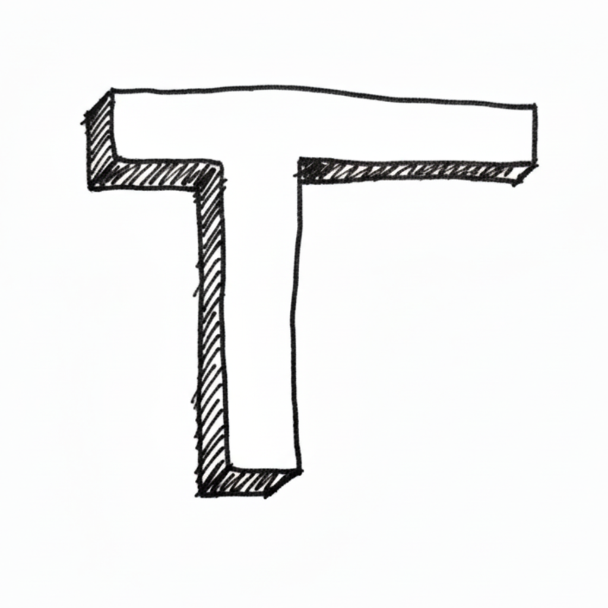

<div align="center">
  
  
  # Tracks
  
  **Offline first fitness app. Track your workout progress with ease.**
  
  [](https://flutter.dev)
  [](https://dart.dev)
  
</div>

## Features

- **Offline First** - Works without internet connection
- **Workout Tracking** - Log exercises, sets, and reps
- **Progress Monitoring** - Track your fitness journey
- **Exercise Library** - Comprehensive exercise database
- **Schedule Workouts** - Plan your training sessions

## Getting Started

### Prerequisites

- Flutter SDK 3.10.4 or higher
- Dart SDK 3.10.4 or higher
- Android SDK 36 (for Android builds)

### Installation

```bash
# Clone the repository
git clone [<repository-url>](https://github.com/kevintherm/tracks.git)

# Navigate to project directory
cd tracks

# Install dependencies
flutter pub get

# Run the app
flutter run
```

## Building

### Android APK
```bash
flutter build apk
```

### iOS
```bash
flutter build ios
```

## Tech Stack

- **Flutter** - UI framework
- **PocketBase** - Backend service
- **Isar** - Local database
- **Provider** - State management

## License

This project is private and not published to pub.dev.
